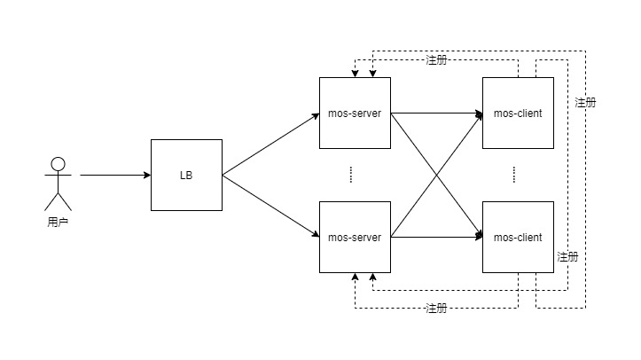

# MOS简介
Martin Object Storage 简易的对象存储服务

功能如下：
1. 提供对象存储服务
2. 支持签名访问，支持设置访问时效
3. 支持java-sdk上传、下载、查询
4. 分片上传、分片下载
5. 断点续传、秒传
6. 简单的文件加密
7. 支持文件自动导入
8. 支持分布式部署、数据分片
9. 支持用户授权
10. 自动生成缩略图
## 逻辑架构图

## demo
- demo地址： <http://mos.668mt.cn>   (账号test/test)  
ps：带宽比较低，上传可能有点慢

# 起步
# 准备环境
## 安装JDK 1.8环境
请在网上找相关教程
## 安装MYSQL8+
请在网上找相关教程
## 安装Redis
请在网上找相关教程
# 下载和解压
[点击下载](http://rs.668mt.cn:6500/mos/mos/releases/mos-2.1.1-RELEASE.zip)

下载完成后，解压。

## 客户端配置
进入client目录，编辑application.properties文件。
1. 配置客户端存储路径
```properties
#客户端存储路径，必填
mos.client.base-paths=G:/test-upload
```
2. 配置服务端的地址
```properties
#服务端地址，必填
mos.client.server-hosts=${server_hosts:http://localhost:9700}
```
3. 配置客户端主机的ip和客户端主机id
```properties
#客户端标识，默认ip+port，建议配置
mos.client.instance.client-id=mos-client-${mos.client.instance.ip}:${server.port}
#客户端ip，默认自动获取，建议配置（多网卡环境下可能导致ip获取错误）
mos.client.instance.ip=192.168.0.2
```
4. 其他配置选填。

## 服务端配置
进入server目录，编辑application.properties文件。
1. 配置MYSQL数据源
```properties
spring.datasource.driver-class-name=com.mysql.cj.jdbc.Driver
spring.datasource.url=jdbc:mysql://localhost:3306/mos?characterEncoding=UTF-8&useSSL=false
spring.datasource.username=root
spring.datasource.password=root
```
2. 配置REDIS
```properties
#redis配置
spring.redis.host=localhost
spring.redis.password=123456
```
3. 配置管理员的账号密码
```properties
#管理员账号
mos.server.admin-username=admin
#管理员密码
mos.server.admin-password=admin
```
4. 配置mos暴露的域名端口
```properties
#mos暴露的域名端口
mos.server.domain=http://localhost:9700
```
5. 其他配置选填

## 启动和访问
进入client目录，点击start脚本启动，windows环境使用start.bat，linux环境使用start.sh。
进入server目录，点击start脚本启动。
访问本地`http://localhost:9700`地址，填入管理员账号进行登录。

# SDK的使用
## 通用的使用方式
1. 引入mos-sdk依赖
```xml
<dependency>
    <groupId>com.github.668mt</groupId>
    <artifactId>mos-sdk</artifactId>
    <version>2.1.3</version>
</dependency>
```
2. 实例化
```java
MosSdk sdk = new MosSdk(...);
```
3. 使用MosSdk进行接口调用
4. 不用时可进行shutdown
```java
sdk.shutdown();
```

## spring-boot-starter的使用方式
1. 引入mos-sdk-spring-boot-starter
```xml
<dependency>
    <groupId>com.github.668mt</groupId>
    <artifactId>mos-sdk-spring-boot-starter</artifactId>
    <version>2.1.3</version>
</dependency>
```
2. 在application里配置mos.config.xxx
```properties
mos.config.host=http://localhost:9700
mos.config.open-id=1
mos.config.bucket-name=xxxxx
mos.config.secret-key=xxxxx
```
3. 在使用的地方注入MosSdk
```java
@Autowired
private MosSdk sdk;
```